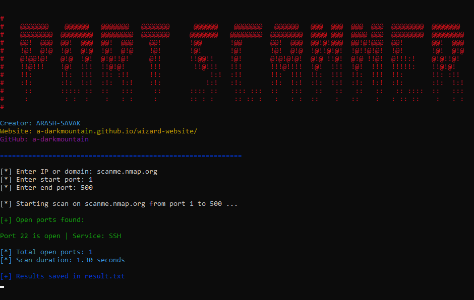

# 🔎 Port Scanner (SAVAK)

این ریپازیتوری شامل کدهای ابزار اسکن پورت من هست.  
هدف از ساخت این ابزار، یادگیری امنیت سایبری، بهبود مهارت‌های پایتون و ایجاد یک پورتفویو حرفه‌ای بوده.  

---

## ✨ ویژگی‌ها
- خروجی رنگی و حرفه‌ای در ترمینال  
- سرعت بالا با استفاده از Multi-threading  
- ذخیره نتایج در فایل `result.txt`  
- قابل اجرا روی ویندوز و لینوکس  
- طراحی بنر ASCII زیبا و شخصی‌سازی‌شده  

---

## 🛠️ تکنولوژی‌ها
- Python 3  
- colorama 
- Git & GitHub  

---

## 📸 پیش‌نمایش
  

---

# 🔎 Port Scanner (SAVAK)

This repository contains the source code of my **Port Scanner** tool.  
The purpose of this project is to practice cybersecurity, improve Python skills, and build a professional portfolio.  

---

## ✨ Features
- Colorful and professional terminal output  
- High speed with multi-threading  
- Save results in `result.txt`  
- Cross-platform (Windows & Linux)  
- Custom ASCII banner design  

---

## 🛠️ Technologies
- Python 3  
- `colorama` library  
- Git & GitHub  

---

## 📸 Preview
  


### Clone the repository
```bash

pip3 install colorama

git clone https://github.com/a-darkmountain/port-scanner.git

cd port-scanner

python3 Port-Scanner.py
